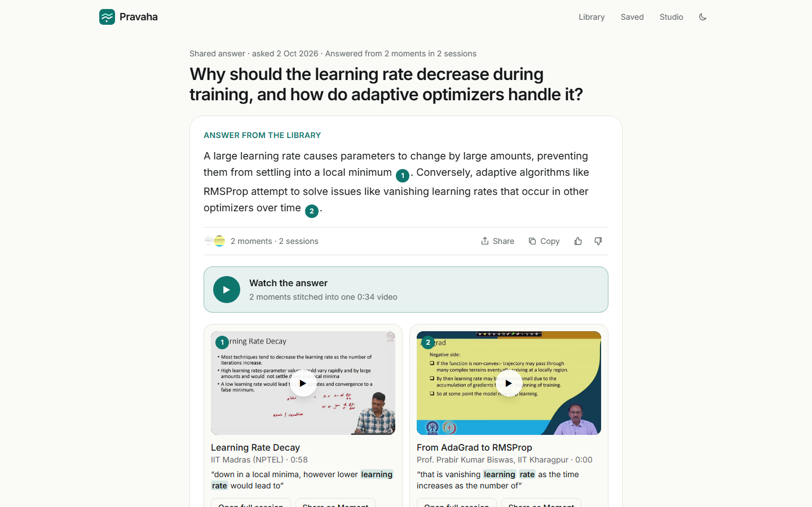
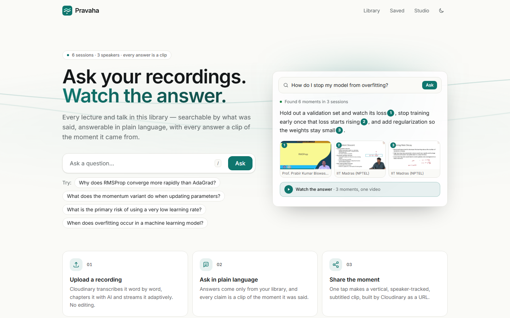
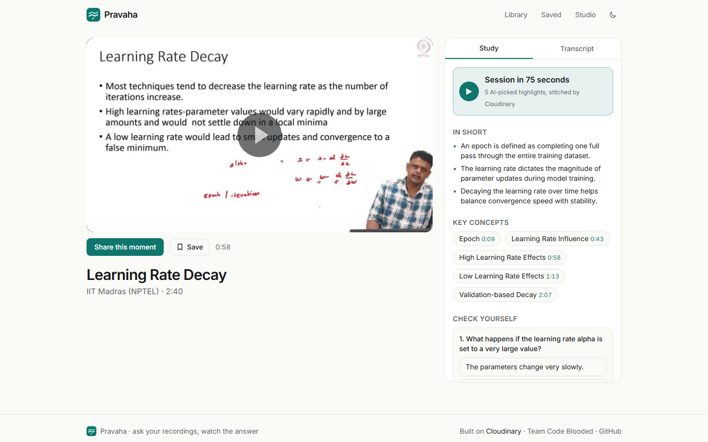
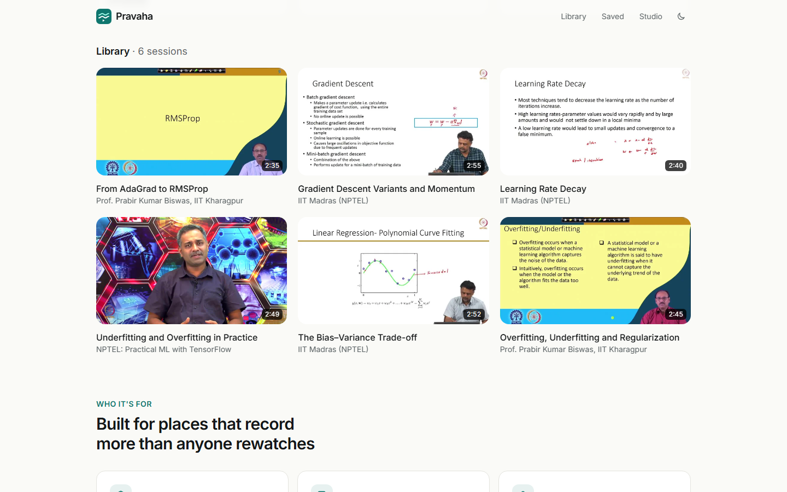
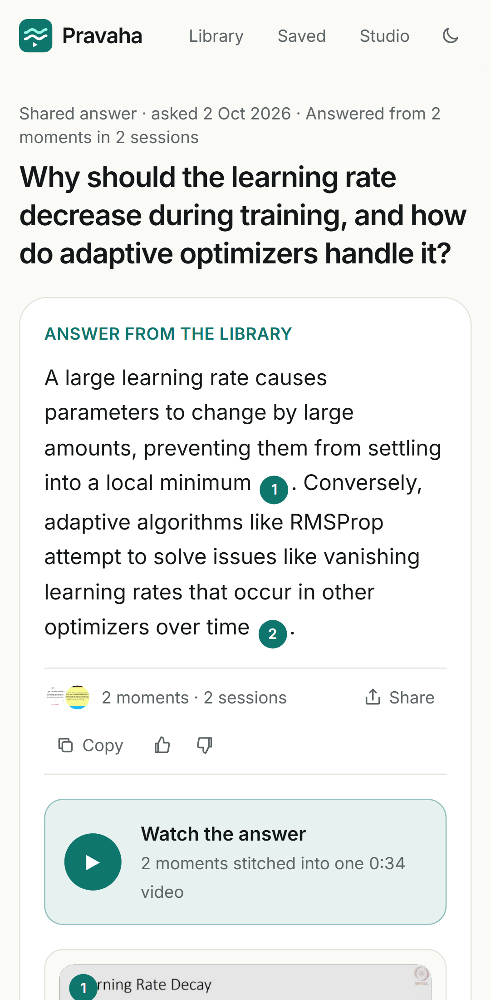
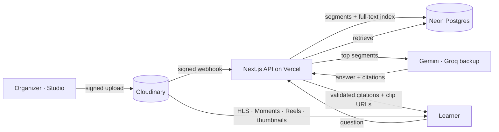

<div align="center">


# Pravaha

**Ask your recordings. Watch the answer.**

Turn hours of recorded lectures and talks into a library you can search, question and quote, where every answer is a playable clip of the moment it was said.

[](https://pravaha-cyan.vercel.app)

[](https://github.com/Monolithic-Dev/Pravaha/actions/workflows/ci.yml)
[](LICENSE)


[**Live app**](https://pravaha-cyan.vercel.app) · [How to test](#how-to-test-it) · [Cloudinary usage](#how-cloudinary-powers-it) · [Run locally](#quick-start) · [Docs](#documentation)

</div>

---

Hackathon project by Team Code Blooded - [hackindia-team:pixels-to-products-cloudinary-ai-hackathon-2026:code-blooded]

| Hackathon | Problem statement | Track | Team |
|---|---|---|---|
| Pixels to Products: Cloudinary AI Hackathon 2026 (HackIndia × Cloudinary) | PS-03 | Track 3: Your Media-Savvy Startup | Code Blooded |

<p align="center">
  
</p>

## Contents

- [The problem](#the-problem)
- [What Pravaha does](#what-pravaha-does)
- [Screenshots](#screenshots)
- [How Cloudinary powers it](#how-cloudinary-powers-it)
- [Architecture](#architecture)
- [How to test it](#how-to-test-it)
- [Quick start](#quick-start)
- [Scripts](#scripts)
- [Project structure](#project-structure)
- [Quality and testing](#quality-and-testing)
- [Security](#security)
- [Deployment](#deployment)
- [Documentation](#documentation)
- [Team](#team)
- [License](#license)

## The problem

Colleges, clubs and coaching institutes record hundreds of hours of lectures and talks. Almost nobody rewatches them, because you can't search a video, skim it, or quote it. The knowledge is recorded, then lost.

## What Pravaha does

| | |
|---|---|
| **Watch** | Upload a raw recording. Cloudinary transcribes it, chapters it and streams it adaptively. No editing. |
| **Find** | Search every session for what was *said* and land on the exact second. |
| **Ask** | Ask a question in plain language. The answer comes **only** from your recordings, and every claim links to a **playable clip** of the moment it came from. Progress streams live while it works, and the answer suggests follow-up questions. If the library doesn't cover a question, Pravaha says so instead of guessing. |
| **Answer Reels** | The moments an answer cites, from different speakers and sessions, stitched into one labelled video. |
| **Study Packs** | Every session gets a summary, key concepts, a quiz whose explanations **play the moment** the teacher explains it, and a "Session in 60 seconds" highlight reel. Pravaha generates them automatically from the transcript. |
| **Moments** | One tap turns any cited clip into a vertical, AI-cropped, subtitled short for WhatsApp or Instagram, with its own share page and preview card. The short is just a Cloudinary URL; nothing is rendered. |
| **Insights** | Organizers see what learners ask, the **knowledge gaps** the library can't answer yet (what to record next), and which Moments get shared. |

> *ChatGPT gives you text. Pravaha gives you the moment your professor said it.*

## Screenshots

| Home | Watch + Study Pack |
|---|---|
|  |  |

<p align="center">
  
  <br /><sub>The demo library: six machine-learning lecture excerpts from four NPTEL courses.</sub>
</p>

<p align="center">
  
  <br /><sub>Ask on a phone. Every screen is built mobile-first.</sub>
</p>

## How Cloudinary powers it

Cloudinary isn't just storage here; the product depends on it.

| Capability | Used for |
|---|---|
| Upload Widget + signed upload preset | Browser-to-Cloudinary video upload with real progress, no server proxy |
| `auto_transcription` | Word-timed transcript: the corpus for Find and Ask, plus subtitles |
| `auto_chaptering` | AI chapters on the player's seek bar |
| Cloudinary Video Player, HLS `sp_full_hd` | Adaptive streaming that survives slow mobile data |
| `so_`/`eo_` + `c_fill,ar_9:16,g_auto` + timed `l_text` captions + `f_auto,q_auto` | **Moments**: trimmed, subject-tracked, subtitled vertical clips |
| `g_auto` thumbnails and poster frames | Content-aware library cards, results and social preview cards |
| `l_video:…,fl_splice` + timed `l_text` labels | **Answer Reels** and **Session in 60 seconds**: moments from one or more sessions stitched into one video |
| Webhooks (`notification_url`, signature-verified) | Upload → transcribed → `ready` with no polling |

**What we built on top:**
- turning transcripts into time-coded segments and indexing them
- library-wide retrieval and ranking (Postgres full-text search)
- grounded Ask, with citations checked on the server and refusal when the library doesn't cover a question
- the Moment and Reel URL composers
- the learner and organizer experience

Full detail: [`docs/CLOUDINARY.md`](docs/CLOUDINARY.md).

## Architecture



- **One Next.js 16 app** (App Router: frontend and API together), deployed on Vercel.
- **Neon Postgres** holds sessions, time-coded segments, the full-text index and insights.
- **Cloudinary** handles everything to do with media.
- **Gemini** handles the AI, with a model fallback chain ending in **Groq** (`gpt-oss-120b`) as a backup provider, and output validated against a Zod schema. If every model fails, Pravaha shows the most relevant clips instead of an error.

Diagrams and reasoning: [`docs/ARCHITECTURE.md`](docs/ARCHITECTURE.md) · [`docs/TRD.md`](docs/TRD.md).

## How to test it

Open the live app at **[pravaha-cyan.vercel.app](https://pravaha-cyan.vercel.app)**. Learners need no login.

1. On the home page, type a question or tap a suggestion. Try "Why should the learning rate decrease during training, and how do adaptive optimizers handle it?": live progress appears, then one answer citing two professors from two institutes, plus an Answer Reel. Or ask in Hindi: "ओवरफिटिंग क्या है?"
2. Hover or tap a citation number to preview the quote. Play a source card: the clip starts at the exact moment. Then try **Watch the answer** (the Answer Reel), **Open full session** or **Share as Moment**.
3. On a session page, open **Study**: the summary, key concepts, a quiz whose explanations play the moment, and "Session in 60 seconds".
4. Search a phrase. The results jump to the second, across sessions.
5. Ask something off-topic ("Who won the IPL?"). Pravaha says the library doesn't cover it instead of making something up.
6. Press `/` or `Ctrl/⌘ K` anywhere to jump to the Ask bar.

Organizer features (upload, publish, insights) live at [`/studio`](https://pravaha-cyan.vercel.app/studio) behind a passcode. Judges can get it from the team.

## Quick start

**Prerequisites:**
- Node.js 20+
- pnpm 9
- Free accounts for Cloudinary, Neon and Google AI Studio

```bash
git clone https://github.com/Monolithic-Dev/Pravaha.git
cd Pravaha
pnpm install
cp .env.example .env.local   # fill in the values, see SETUP.md
pnpm db:migrate
pnpm dev                     # http://localhost:3000
```

[`SETUP.md`](SETUP.md) walks through every account from zero and explains every environment variable:

| Variable | Purpose |
|---|---|
| `NEXT_PUBLIC_CLOUDINARY_CLOUD_NAME`, `NEXT_PUBLIC_CLOUDINARY_API_KEY` | Public Cloudinary identifiers for the player and Upload Widget |
| `CLOUDINARY_API_SECRET`, `CLOUDINARY_UPLOAD_PRESET` | Server-side signing and the signed upload preset |
| `DATABASE_URL` | Neon Postgres connection string |
| `GEMINI_API_KEY`, `GEMINI_MODELS` | Gemini key and the ordered model fallback chain |
| `GROQ_API_KEY` | Optional backup AI provider, used when every Gemini model fails |
| `ORGANIZER_PASSCODE`, `SESSION_SECRET` | Studio sign-in and the signing key for its session cookie |
| `APP_URL` | Public base URL (webhooks, share links, preview cards) |

## Scripts

| Command | What it does |
|---|---|
| `pnpm dev` | Start the dev server |
| `pnpm build` / `pnpm start` | Production build / serve it |
| `pnpm lint` · `pnpm typecheck` | ESLint · `tsc --noEmit` |
| `pnpm test` | Unit tests (Vitest) |
| `APP_URL=… pnpm test:e2e` | Playwright smoke tests against a deployed app, desktop and mobile |
| `pnpm eval:ask` | Evaluate Ask: grounding, citations and refusals ([`docs/AI_EVALUATION.md`](docs/AI_EVALUATION.md)) |
| `pnpm db:migrate` | Apply database migrations |

## Project structure

```
src/
  app/                 Routes (App Router)
    page.tsx             Home: Ask bar, how it works, library
    search/              Ask + Find results
    watch/[id]/          Player, chapters, transcript, Study Pack
    m/[segmentId]/       Shareable Moment page with its own preview card
    studio/              Organizer: upload, publish, insights
    api/                 ask · search · lectures · upload-signature · webhooks · organizer · insights · events
  components/          UI (client components where interactivity needs it)
  lib/                 Server logic: retrieval, grounded answers, citation checks, Cloudinary URL composers,
                       ingest, auth, rate limits, env validation
tests/
  unit/                Vitest
  e2e/                 Playwright smoke tests
  eval/                Ask evaluation set
scripts/               Migrations, eval runner, local end-to-end
docs/                  Product, technical, security and process docs
openapi.yaml           API specification (OpenAPI 3.0)
```

## Quality and testing

- **CI** runs lint, typecheck, unit tests and a production build on every pull request and every push to `main`.
- **Unit tests** cover the parts that decide what users see:
  - citation validation and refusal
  - follow-up question cleaning
  - transcript segmentation
  - the Moment and Reel URL composers
  - Study Pack validation, chapter parsing and upload-signing policy
  - webhook signatures and passcode checks
- **End-to-end smoke tests** run in Playwright on desktop and mobile against the live deployment:
  - home page
  - Find lands on the exact second
  - Ask answers with a playable citation
  - Ask refuses an off-topic question
  - unauthenticated organizer requests and unsigned webhooks are rejected
- **The AI eval** ([`docs/AI_EVALUATION.md`](docs/AI_EVALUATION.md)) on production, Oct 2: **11/11 passed**: 8/8 answerable questions cited the expected session (including one in Hindi), 3/3 off-topic questions refused, 0 fallbacks, and **31/32 citations (97%)** supported their sentence on a manual check.
- **Accessibility:** a skip link, visible focus rings, keyboard shortcuts, and every animation disabled under `prefers-reduced-motion`.

## Security

- Organizer routes need a passcode session: a signed, `HttpOnly` cookie.
- Uploads are signed, short-lived and size-capped.
- Cloudinary webhooks are signature-verified.
- Ask is rate-limited per IP before any paid call.
- Model output is schema-validated, and citations are checked against what was actually retrieved, which defends against prompt injection.
- No credentials are committed anywhere in this repository or its history.

Details: [`docs/SECURITY.md`](docs/SECURITY.md).

## Deployment

The app deploys to **Vercel**: every push to `main` deploys production, and pull requests get preview deployments. Environment variables live in Vercel, with secrets marked Sensitive. Step-by-step: [`SETUP.md` §7](SETUP.md).

## Documentation

| Doc | What's in it |
|---|---|
| [`docs/VISION.md`](docs/VISION.md) | Why this is a company: wedge, customer, growth loop, roadmap |
| [`docs/PRD.md`](docs/PRD.md) | Problem, users, requirements, acceptance criteria |
| [`docs/CLOUDINARY.md`](docs/CLOUDINARY.md) | Every Cloudinary capability, and what breaks without it |
| [`docs/TRD.md`](docs/TRD.md) · [`docs/ARCHITECTURE.md`](docs/ARCHITECTURE.md) | Stack, reasoning, diagrams |
| [`docs/DATABASE.md`](docs/DATABASE.md) · [`docs/API.md`](docs/API.md) · [`openapi.yaml`](openapi.yaml) | Schema and endpoints |
| [`docs/AI_EVALUATION.md`](docs/AI_EVALUATION.md) | Ask's retrieval, prompt, citation validation, fallback and eval |
| [`docs/UX_UI.md`](docs/UX_UI.md) · [`docs/DESIGN_SYSTEM.md`](docs/DESIGN_SYSTEM.md) | Screens, interaction and motion, design tokens |
| [`docs/SECURITY.md`](docs/SECURITY.md) · [`docs/COST.md`](docs/COST.md) | Trust boundaries and cost controls |
| [`docs/TESTING.md`](docs/TESTING.md) · [`docs/OBSERVABILITY.md`](docs/OBSERVABILITY.md) | Test strategy, logs and events |
| [`docs/DECISIONS.md`](docs/DECISIONS.md) | Every decision with alternatives and trade-offs, including what we changed and why |
| [`docs/IMPLEMENTATION_PLAN.md`](docs/IMPLEMENTATION_PLAN.md) · [`docs/phases/`](docs/phases/) | The 3-day build, phase by phase |
| [`docs/GIT_WORKFLOW.md`](docs/GIT_WORKFLOW.md) | Branch per feature, PR, merge rules |
| [`docs/DEMO.md`](docs/DEMO.md) · [`docs/SUBMISSION_CHECKLIST.md`](docs/SUBMISSION_CHECKLIST.md) | Demo script and submission tracking |

## Demo library and credits

The live library is six 2.5–3 minute excerpts from [NPTEL](https://nptel.ac.in) (IIT/IISc's National Programme on Technology Enhanced Learning) machine-learning courses, licensed **CC BY-NC-SA**. The excerpts are shared under the same licence, for non-commercial demonstration, with credit to:

| Session | Course | Institute |
|---|---|---|
| Overfitting, Underfitting and Regularization · From AdaGrad to RMSProp | [Deep Learning](https://nptel.ac.in/courses/106105215), Prof. Prabir Kumar Biswas | IIT Kharagpur |
| The Bias–Variance Trade-off · Learning Rate Decay · Gradient Descent Variants and Momentum | [Machine Learning for Engineering and Science Applications](https://nptel.ac.in/courses/106106198) | IIT Madras |
| Underfitting and Overfitting in Practice | [Practical Machine Learning with TensorFlow](https://nptel.ac.in/courses/106106213) | IIT Madras |

Pravaha is built for an institution's own recordings; these public lectures stand in for them in the demo.

## Team

**Code Blooded:** [@Mahakisore7](https://github.com/Mahakisore7) · [@im-rk](https://github.com/im-rk)

Built in three days for Pixels to Products: Cloudinary AI Hackathon 2026, organized by HackIndia × Cloudinary.

## License

[Apache-2.0](LICENSE). Pravaha is built on [Cloudinary](https://cloudinary.com), [Next.js](https://nextjs.org), [Neon](https://neon.tech) and [Google Gemini](https://ai.google.dev).
